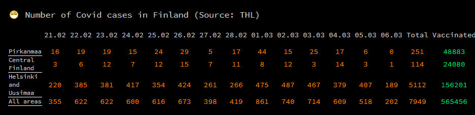

# MagicMirror² Module: Covid-THL 
MagicMirror² module for checking Covid data in Finland (source: [THL](https://thl.fi/en/web/thlfi-en/statistics/statistical-databases/open-data/confirmed-corona-cases-in-finland-covid-19-))



## Installation

Remote to your MM2-box with your terminal software and go to your MagicMirror's Module folder:
````bash
cd ~/MagicMirror/modules
````

Clone the repository:
````bash
git clone https://github.com/Dobbychen/MMM-COVID-THL.git
````

Go to the modules folder:
````bash
cd MMM-COVID-THL
````

## Dependencies:
This module relies on [jsonstat-toolkit](https://github.com/jsonstat/toolkit) to parse THL data.

Install the dependencies (in the root):
````bash
npm install jsonstat-toolkit
````

Add the module to the modules array in the `config/config.js` file by adding the following section. You can change this configuration later when you see this works:
```
{
	module: "MMM-COVID-THL",
	position: "bottom_center",
	config: {}
},
```

# Configuration options

These are the valid configuration options you can put inside the config array above:

Configuration option | Comment | Default 
---|---|---
updateInterval | Refresh rate to call this API, there is no point to set this too low as THL updates their data daily | 7200000
districtWatchList | districts to follow | ["All", "Uusimaa", "Pirkanmaa"]
lastDateOffset | Offset of last date comparing to today. | 0 
days | How many days of entries | 14
moduleTitle | Title for the data table | 😷 Number of Covid cases in Finland (Source: THL)
infectedColor | CSS text color for Covid-19 positive numbers |  "red" 
vaccinatedColor | Css text color for Covid-19 vaccincated numbers | "green" 

# Translations

Currently no translation is available yet.

# Current development status

This module is currently being maintained, weyy! 🎉